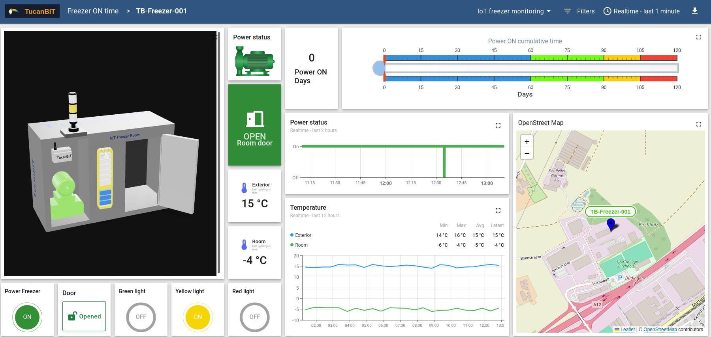

# José Luis Carrera Villacrés

Senior Cloud Data Infrastructure Engineer / Platform Architect building secure,
scalable, high-availability platforms for distributed, IoT, and data-intensive
systems; from architecture and data flows to hands-on AWS and
infrastructure-as-code (Terraform, Terragrunt).

[](https://www.credly.com/badges/ead47c5b-e271-4d7b-b8b0-003520da4ae3/linked_in?t=t8hinh)
[](https://scholar.google.com/citations?user=fuKyK-0AAAAJ&hl=en)
[](https://www.linkedin.com/in/jlcarvi/)


## Scan highlights

- **Current activities:** TucanBit technical consulting, portfolio engineering,
  and expanding my cloud-platform expertise toward GNSS and satellite systems.
- **Cloud certification:** AWS Certified Solutions Architect – Associate;
  preparing AWS Certified Solutions Architect – Professional.
- **Research foundation:** PhD in Distributed Systems and Wireless Sensor
  Networks, University of Bern.
- **Production scale:** ComatReleco Industrial IoT/cloud platform experience
  with **8,000+ devices** and **3,000+ customers**.
- **Delivery style:** Architecture decisions connected to hands-on AWS,
  infrastructure-as-code, observability, and secure operations.
- **Contact path:** Connect through
  [LinkedIn](https://www.linkedin.com/in/jlcarvi/).

## Current personal project: Generic IoT integration

I am building a public reference project for a generic IoT integration flow:
device simulation, AWS IoT Core, device shadows, IoT Rules, and ThingsBoard as
an interactive dashboard layer.

The goal is to turn practical IoT/cloud architecture knowledge into something
visible and reusable: how devices report state, how cloud-side desired state is
handled, how IoT Rules route messages, and how operational data can be exposed
through a live dashboard.

**Architecture:**

```text
Device simulator
  -> AWS IoT Core
  -> Device Shadow: desired / reported state
  -> IoT Rules
  -> ThingsBoard integration
  -> Public interactive dashboard
```

- **Live dashboard:**
  [ThingsBoard public demo](https://demo.thingsboard.io/dashboard/50942f00-3187-11f0-905b-715188ad2cd8?publicId=52bf0710-2953-11ef-9b56-a3c78ba98c39)
  with a Blender-built 3D model representing a digital twin, room and exterior
  temperature sensors, and five user-controlled actuators: freezer power, door
  state, and three visual alarms. The actuators update the AWS IoT Core desired
  shadow state,
  which is then processed by the simulator and reported back through the IoT
  flow.



- **Infrastructure:**
  [iot-infra-aws-iac](https://github.com/jlcarvi/iot-infra-aws-iac) — AWS IoT
  infrastructure as code with Terraform and Terragrunt.
- **Device shadow flow:**
  [sim-desired-status](https://github.com/jlcarvi/sim-desired-status) — desired
  and reported state simulation using real AWS IoT Core shadow functionality.
- **ThingsBoard integration:**
  [tb-forwarded](https://github.com/jlcarvi/tb-forwarded) — integration between
  the IoT data flow and the dashboard layer.
- **Development simulator:**
  [iam-dev-simulator](https://github.com/jlcarvi/iam-dev-simulator) — local
  simulator for development and integration practice.

## Direction: emerging Space/GNSS specialization

Expanding my distributed-systems, telemetry, positioning and cloud-platform expertise toward GNSS and satellite data infrastructure through the Joint Navigation Satellite Programme.

## Core skills

### Cloud and IoT architecture

- AWS IoT Core for managed device connectivity and IoT message ingestion.
- MQTT-based communication patterns for distributed device fleets.
- AWS Lambda for event-driven processing and platform automation.
- Amazon SQS for decoupled workloads and asynchronous processing.
- Amazon SNS for notification-oriented workflows.

### Data and platform systems

- DynamoDB for cloud-native operational data access patterns.
- PostgreSQL for relational data, reporting, and platform persistence.
- Data-flow design for distributed, IoT, and data-intensive systems.
- High-availability thinking across ingestion, processing, storage, and
  monitoring layers.

### Infrastructure, security, and operations

- Terraform for infrastructure-as-code and repeatable AWS provisioning.
- Docker for packaging, deployment consistency, and local reproducibility.
- Grafana and Amazon CloudWatch for observability and operational insight.
- TLS/mTLS for secure device and service communication.
- MFA and identity-aware controls for production access paths.

## Selected project evidence

### ComatReleco industrial IoT and cloud platform

Private-company platform work; this entry is intentionally descriptive only and
does not link to repositories or expose confidential implementation details.

- Built and evolved an industrial IoT/cloud platform serving **8,000+ devices**
  and **3,000+ customers**.
- Worked across architecture, data flows, AWS services, observability, and
  infrastructure-as-code.
- Used AWS IoT Core, MQTT, Lambda, SQS, DynamoDB, PostgreSQL, Docker,
  Terraform, Grafana, CloudWatch, TLS/mTLS, and MFA.
- Focused on secure, scalable, high-availability platform behavior for
  distributed device environments.

### Distributed systems and wireless analytics research

Academic research complements the production platform work with deeper grounding
in distributed systems, wireless systems, analytics, and data-intensive problem
spaces.

- PhD in Distributed Systems and Wireless Sensor Networks, University of Bern.
- Selected publications are available through
  [Google Scholar](https://scholar.google.com/citations?user=fuKyK-0AAAAJ&hl=en).
- Research background supports architecture work where correctness, scale,
  communication patterns, signal interpretation, and positioning-related data
  matter.

### Digital Twin ColdRoom Monitoring dashboard

In development. Public repositories are planned, but no repository is linked
until the work is available publicly.

- Goal: digital-twin style monitoring for cold-room environments.
- Planned stack: AWS IoT Core, AWS Lambda, Amazon SNS, Amazon SQS, and
  ThingsBoard.
- Intended focus: device telemetry, alerts, operational dashboards, and a clear
  public write-up once the implementation is ready to share.

## Credentials, education, and research

### Certification

- AWS Certified Solutions Architect – Associate.
- Verification:
  [Credly badge](https://www.credly.com/badges/ead47c5b-e271-4d7b-b8b0-003520da4ae3/linked_in?t=t8hinh).
- Preparing AWS Certified Solutions Architect – Professional.
- Joint Navigation Satellite Programme training starting September 2026.

### Education and recognition

- PhD in Distributed Systems and Wireless Sensor Networks, University of Bern.
- Faculty of Science prize for doctoral dissertation.

### Publications

- Selected publications are listed on
  [Google Scholar](https://scholar.google.com/citations?user=fuKyK-0AAAAJ&hl=en).
- Individual publication links are intentionally not duplicated here unless they
  are verified and current.

## How I think about platforms

Good cloud infrastructure is not a collection of services; it is a set of
operational promises. The important questions are usually simple to ask and hard
to answer well:

- What must keep working when devices, queues, or dependencies fail?
- Which data needs strong structure, and which data needs flexible ingestion?
- Where should the system be asynchronous, and where does the user need direct
  feedback?
- How will the team observe the platform before a customer notices a problem?
- Which security controls must be part of the default path, not an afterthought?

That is the level where I like to work: architecture that survives production,
implementation that respects operational reality, and documentation that helps
the next engineer understand the system faster.

## Contact

- Location: Fribourg, Switzerland.
- Languages: English fluent, French B1 conversational, Spanish native.
- LinkedIn: [linkedin.com/in/jlcarvi](https://www.linkedin.com/in/jlcarvi/)
- Google Scholar:
  [scholar.google.com/citations?user=fuKyK-0AAAAJ](https://scholar.google.com/citations?user=fuKyK-0AAAAJ&hl=en)
- AWS credential:
  [Credly verification](https://www.credly.com/badges/ead47c5b-e271-4d7b-b8b0-003520da4ae3/linked_in?t=t8hinh)
